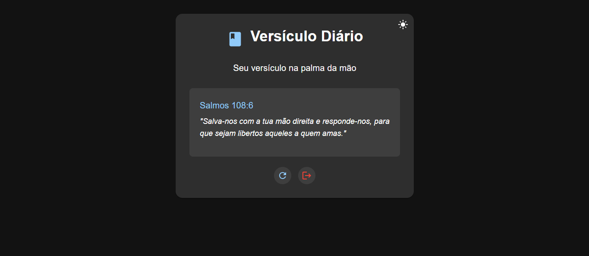

<h1 align="center">
    <a href="https://laravelcollective.com/tools/banner">
        
    </a>
</h1>

# Versículo Diário

<p align="center"> Uma aplicação React que mostra um versículo bíblico aleatório todos os dias </p>

<h2 align="center">
  
  
  
</h2>

## 📌 Índice
<p align="center">         
  <a href="#tecnologias">Tecnologias </a> &nbsp; &nbsp; &nbsp; | &nbsp; &nbsp; &nbsp;        
  <a href="#instalação"> Instalação e Uso </a> &nbsp; &nbsp; &nbsp; | &nbsp; &nbsp; &nbsp;
  <a href="#apoie-o-criador-da-api"> Apoie o Criador da API </a> &nbsp; &nbsp; &nbsp;
</p>          

## Tecnologias                                


## ⚙ Instalação   

### Rodar projeto localmente

Primeiro, clone o repositório para seu ambiente:

```bash
> git clone https://github.com/Gabrielrc11/versiculo_diario.git
```

Entre na pasta do projeto:

```bash
> cd devfolio
```

Instale as dependencias do projeto:

```bash
> npm install
```

Por ultimo, rode o projeto localmente:

```bash
> npm run dev
```

-------------        

## Como Usar

1. Ao acessar a aplicação, você verá uma tela de login
2. Se não tiver uma conta, clique em "Não tem uma conta? Registre-se"
3. No formulário de registro, preencha:
   - Nome
   - Email
   - Senha
4. Após criar a conta, você será automaticamente logado
5. Na tela principal você pode:
   - Ver o versículo do dia
   - Clicar em "Novo Versículo" para ver outro versículo
   - Clicar em "Sair" para fazer logout

## Funcionalidades

- Sistema completo de autenticação (login/registro)
- Exibe um versículo bíblico aleatório
- Interface moderna e responsiva
- Atualização manual do versículo
- Persistência do login usando localStorage
- Botão de logout

## Apoie o Criador da API

Este projeto utiliza a API da Bíblia Digital para fornecer os versículos bíblicos. A API é mantida por desenvolvedores independentes que dedicam tempo e recursos para manter este serviço gratuito.

### Como apoiar:

- **Estrela no GitHub**: Acesse o [repositório oficial](https://github.com/marciovsena/bibleapi) e deixe uma estrela
- **Contribuições financeiras**: Considere fazer uma doação pelo seu [site oficial](https://www.abibliadigital.com.br/) e deixe uma estrela
- **Contribuições técnicas**: Ajude no desenvolvimento da API enviando pull requests, reportando possiveis bugs e melhorias
- **Compartilhe**: Divulgue o projeto nas redes sociais

Seu apoio é fundamental para manter esta API disponível para todos e continuar espalhando a palavra de deus pelo mundo!

---------------------------------

- [Voltar ao Início](#index)